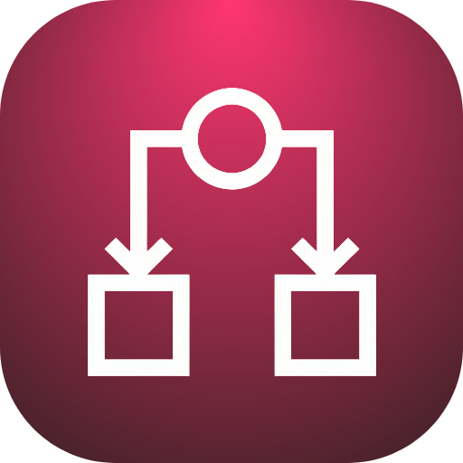
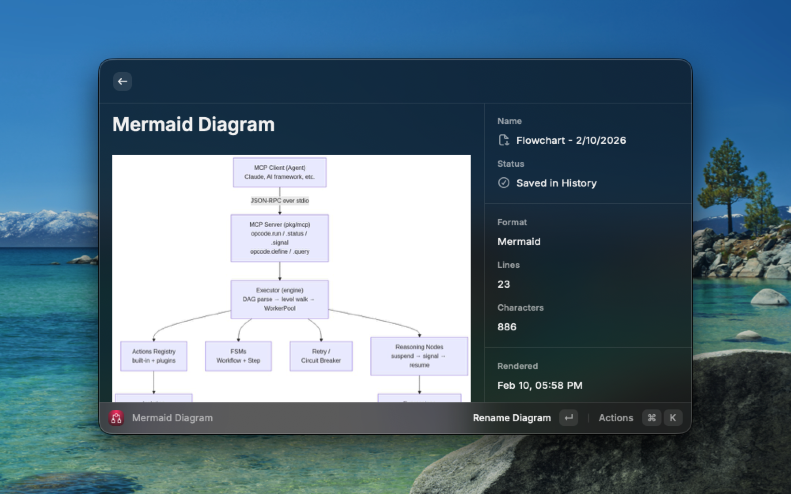
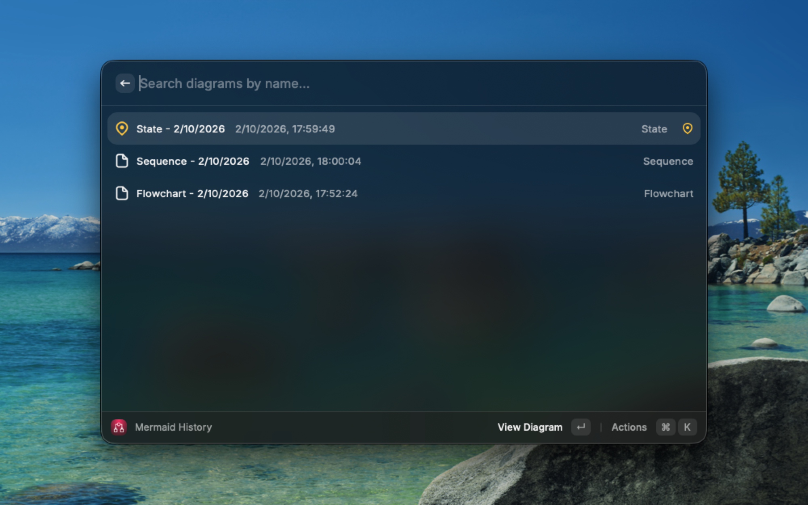

<div align="center">
  

  <picture>
    <source media="(prefers-color-scheme: dark)" srcset="assets/banner-dark.svg">
    
  </picture>

[](https://raycast.com) [](LICENSE) [](https://www.typescriptlang.org/)

</div>

Instantly render Mermaid diagrams from your clipboard with automatic monitoring (1-second polling), persistent history with search and pinning, and seamless Mermaid Live Editor integration. Built for diagram-driven workflows.

## ✨ Features

### 🎯 Real-time Clipboard Monitoring
- Copy any Mermaid code → see it rendered automatically
- No need to close and reopen — diagrams update in real-time
- 1-second polling for instant feedback
- Smart detection of 13+ Mermaid diagram types

### 📊 Instant Rendering
All Mermaid diagram types supported via [mermaid.ink](https://mermaid.ink):
- Flowcharts & sequence diagrams
- Class, state, and ER diagrams
- Gantt charts & pie charts
- User journeys & git graphs
- Mind maps, timelines & quadrant charts

### 📚 Smart History Management
- **Auto-save**: Every rendered diagram saved automatically
- **Deduplication**: Same diagram? Updates last accessed time
- **Search**: Filter by diagram name
- **Pin**: Keep frequently used diagrams at the top
- **Rename**: Give meaningful names (e.g., "User Auth Flow v2")
- **Last Accessed Sorting**: Most recent first (pinned always on top)
- **Limit**: 100 most recent diagrams

### ⚡ Quick Actions

**Render Command** (`⌘ + Space` → "Render Mermaid")
- `⌘ + R` — Rename current diagram (if saved)
- `⌘ + S` — Save to history (if not saved)
- `⌘ + H` — Open History
- `⌘ + E` — Expand diagram (full-screen in browser)
- `⌘ + C` — Copy Mermaid code
- `⌘ + ⇧ + C` — Copy image URL

**History Command** (`⌘ + Space` → "Mermaid History")
- `⌘ + I` — Pin/unpin diagram
- `⌘ + R` — Rename diagram
- `⌘ + D` — Delete diagram
- `⌘ + C` — Copy code
- `⌘ + H` — Back to history (from detail view)

## 📸 Screenshots

<div align="center">
  
  <p><em>Automatic rendering with metadata panel showing save status, diagram stats, and quick actions</em></p>

  <br/>

  
  <p><em>Search, pin, and manage all your diagrams in one place</em></p>
</div>

## 🚀 Installation

### From Raycast Store (Recommended)
1. Open Raycast (`⌘ + Space`)
2. Type "Store" → Enter
3. Search "Mermaid Live"
4. Click "Install"

### From Source
```bash
git clone https://github.com/rendis/mermaid-live-raycast.git
cd mermaid-live-raycast
npm install
npm run dev
```

## 💡 Usage

### Quick Start
1. Copy Mermaid code to clipboard:
   ```
   graph TD
       A[Start] --> B[Process]
       B --> C[End]
   ```
2. Open Raycast (`⌘ + Space`)
3. Type "Render Mermaid" → Enter
4. Watch the magic happen ✨

### Working with History
1. Rendered diagrams auto-save to history
2. Open "Mermaid History" from Raycast
3. Pin important diagrams (`⌘ + I`)
4. Rename for better organization (`⌘ + R`)
5. Search by name to find quickly

### Edit Workflow
1. Render a diagram
2. Click "Edit in Mermaid Live" (or press Enter on the action)
3. Opens [mermaid.live](https://mermaid.live) with your diagram pre-loaded
4. Edit visually with live preview
5. Copy the updated code back to clipboard

## 🏗️ Architecture

```
┌─────────────────────────────────────────┐
│  Raycast Extension (React + TypeScript) │
├─────────────────────────────────────────┤
│  • Clipboard Polling (1s interval)      │
│  • LocalStorage (history persistence)   │
│  • pako compression (URL encoding)      │
└──────────────┬──────────────────────────┘
               │
               ▼
┌─────────────────────────────────────────┐
│         mermaid.ink API                 │
│  (Serverless diagram rendering)         │
└─────────────────────────────────────────┘
```

**Tech Stack:**
- **Framework**: [Raycast API](https://developers.raycast.com) v1.104.5
- **Language**: TypeScript 5.0+
- **Rendering**: [mermaid.ink](https://mermaid.ink) (on-demand, no local dependencies)
- **Compression**: [pako](https://github.com/nodeca/pako) for URL-safe encoding
- **Storage**: LocalStorage for history and persistence

## 🛠️ Development

```bash
# Install dependencies
npm install

# Start development mode with hot reload
npm run dev

# Build for production
npm run build

# Lint and format
npm run lint
npm run fix-lint

# Publish to Raycast Store
npm run publish
```

## 📝 Supported Diagram Types

Mermaid Live detects and renders all Mermaid diagram types:

| Type | Keyword | Example |
|------|---------|---------|
| Flowchart | `graph`, `flowchart` | Process flows, decision trees |
| Sequence | `sequenceDiagram` | API interactions, protocols |
| Class | `classDiagram` | UML class structures |
| State | `stateDiagram` | State machines, FSMs |
| ER | `erDiagram` | Database schemas |
| Gantt | `gantt` | Project timelines |
| Pie | `pie` | Data distributions |
| Journey | `journey` | User experience flows |
| Git Graph | `gitGraph` | Branch workflows |
| Mindmap | `mindmap` | Brainstorming, hierarchies |
| Timeline | `timeline` | Historical events |
| Quadrant | `quadrantChart` | Priority matrices |

## 🎨 Customization

Diagrams use Mermaid's default theme. To customize:

1. Render your diagram
2. Click "Edit in Mermaid Live"
3. Adjust theme, colors, and styles in the editor
4. Copy the updated code with inline styling

## 🐛 Troubleshooting

**Diagram not rendering?**
- Verify Mermaid syntax at [mermaid.live](https://mermaid.live)
- Check your internet connection (mermaid.ink requires network access)
- Try copying the code again

**Clipboard not detected?**
- Ensure you have clipboard access enabled for Raycast
- System Preferences → Security & Privacy → Privacy → Accessibility

**Icon not showing?**
- Rebuild the extension: `npm run build`
- Restart Raycast dev mode: `npm run dev`
- If persistent, uninstall/reinstall extension in Raycast

## 📄 License

[MIT](LICENSE) © Reynaldo Endis

## 🙏 Acknowledgments

- [Mermaid.js](https://mermaid.js.org) — Incredible diagramming syntax
- [mermaid.ink](https://mermaid.ink) — Serverless rendering service
- [Raycast](https://raycast.com) — Blazing fast launcher
- [pako](https://github.com/nodeca/pako) — Fast compression library

---

<div align="center">
  Made with ❤️ for diagram lovers
</div>
