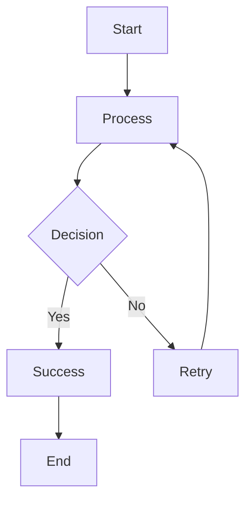

# Mermaid Live - Raycast Extension

Render Mermaid diagrams from your clipboard instantly with real-time monitoring and full history management.

## Commands

### 🎨 Render Mermaid Diagram
Real-time diagram rendering from clipboard

### 📚 Mermaid History
Browse, search, and manage all your diagrams in one place

## Features

### 🎯 Real-time Clipboard Monitoring
- Copy any Mermaid code to your clipboard
- Open the extension and see it rendered automatically
- No need to close and reopen - diagrams update in real-time (1-second polling)
- Last diagram persists between sessions

### 📊 Diagram Rendering
- Instant rendering using mermaid.ink API
- Support for all Mermaid diagram types:
  - Flowcharts
  - Sequence diagrams
  - Class diagrams
  - State diagrams
  - ER diagrams
  - Gantt charts
  - Pie charts
  - User journeys
  - Git graphs
  - Mind maps
  - Timelines
  - Quadrant charts

### 📚 History Management
- **Automatic History**: Every rendered diagram is automatically saved to history
- **Smart Deduplication**: Duplicate diagrams (same code) update last accessed time
- **Last Accessed Sorting**: Diagrams sorted by most recently accessed (pinned items always on top)
- **Search**: Quick search by diagram name
- **Pin Important Diagrams**: Keep frequently used diagrams at the top
- **Rename**: Give meaningful names to your diagrams (from render or history view)
- **Delete**: Remove unwanted diagrams from history
- **Save Status**: See if current diagram is saved with visual indicators
- **Manual Save**: Option to save to history with ⌘ + S if not auto-saved
- **Limit**: History limited to 100 most recent diagrams

### ⚡ Quick Actions

#### Render Command
- **⌘ + R**: Rename current diagram (if saved)
- **⌘ + S**: Save to history (if not saved)
- **⌘ + H**: Open History (quick access to history command)
- **⌘ + E**: Expand Diagram (opens in browser for full-screen view)
- **⌘ + C**: Copy Mermaid Code
- **⌘ + ⇧ + C**: Copy Image URL
- **Edit in Mermaid Live**: Opens diagram in mermaid.live editor

**Metadata Panel Shows:**
- 💾 Diagram name (if saved) or "Not Saved" status
- ✅ "Saved in History" or ❌ "Not Saved" indicator
- Format, lines, characters count
- Rendered timestamp

#### History Command
- **⌘ + I**: Pin/Unpin diagram
- **⌘ + R**: Rename diagram
- **⌘ + D**: Delete diagram
- **⌘ + C**: Copy code
- **Search**: Type to filter by name
- **View Diagram**: Click to see full diagram with metadata

#### Diagram Detail View (from History)
- **⌘ + H**: Back to History
- **⌘ + E**: Expand Diagram (opens in browser)
- **⌘ + C**: Copy Code
- **⌘ + ⇧ + C**: Copy Image URL
- **Edit in Mermaid Live**: Opens diagram in mermaid.live editor

## Usage

### Rendering Diagrams
1. Copy Mermaid code to clipboard (⌘ + C)
2. Open Raycast (⌘ + Space)
3. Type "Render Mermaid"
4. Press Enter
5. See your diagram rendered instantly!

### Accessing History
1. Open Raycast (⌘ + Space)
2. Type "Mermaid History"
3. Press Enter
4. Browse, search, pin, rename, or delete diagrams

### Example Mermaid Code


### Working with History
1. Render any diagram (it's automatically saved to history)
2. Open Raycast and type "Mermaid History"
3. Search for diagrams by name
4. Pin important diagrams to keep them at the top (**⌘ + I**)
5. Rename diagrams for better organization (**⌘ + R**)
6. Click any diagram to view it full-size
7. Delete diagrams you no longer need (**⌘ + D**)

### Naming Conventions
- Diagrams are auto-named with type and date: `Flowchart - 2/10/2024`
- Rename diagrams for better organization: `User Registration Flow`, `Database Schema v2`
- Search works on diagram names

## States

### Empty Clipboard
Shows a friendly message with example code to try

### Invalid Mermaid
Helpful guidance showing all supported diagram types with examples

### Loading
Quick loading indicator while rendering (usually < 1 second)

### Rendered
Full diagram display with metadata panel showing:
- Format: Mermaid
- Lines of code
- Character count
- Rendered timestamp
- Links to documentation and live editor

## Technical Details

- **Storage**: LocalStorage for persistence
- **API**: mermaid.ink for rendering
- **Compression**: pako (deflate) for efficient URL encoding
- **Polling**: 1-second interval for clipboard monitoring
- **History Limit**: 100 diagrams (FIFO)
- **Deduplication**: By diagram code (exact match)

## Development

```bash
# Install dependencies
npm install

# Development mode
npm run dev

# Build
npm run build

# Lint
npm run lint
```

## License

MIT
